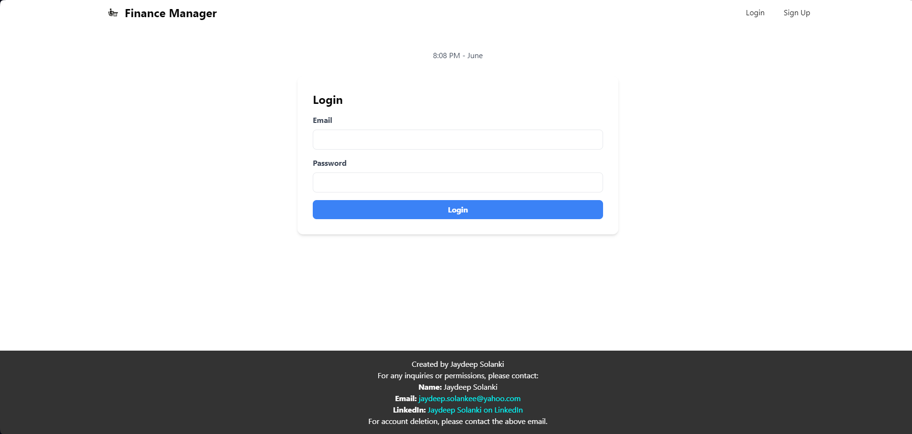
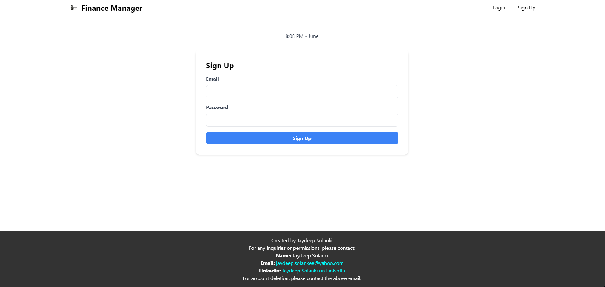
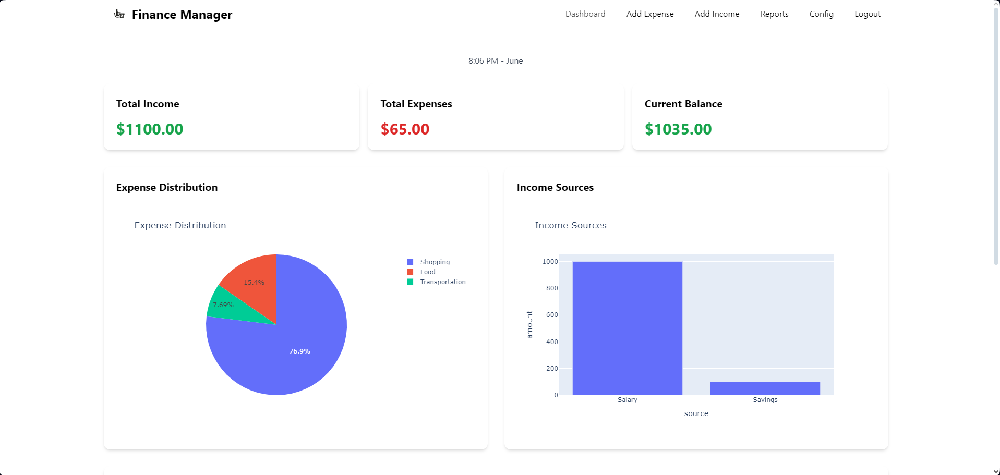
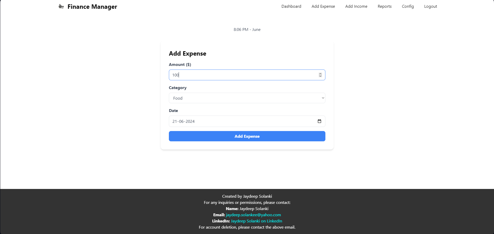
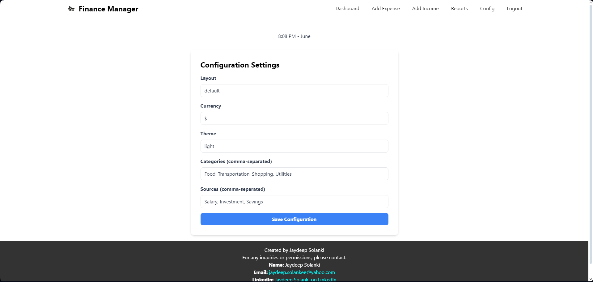
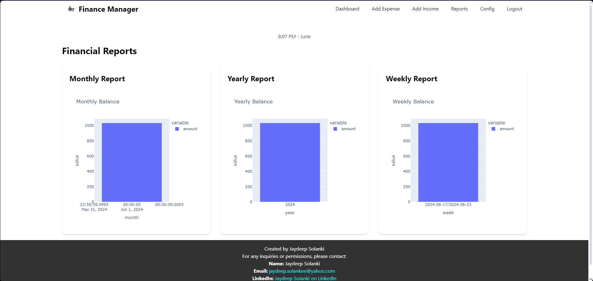

# Finance Manager

Finance Manager is a web-based application designed to help users manage their finances by tracking incomes and
expenses, generating various financial reports, and customizing financial settings.

## Table of Contents

- [Features](#features)
- [Installation](#installation)
- [Use Cases](#use-cases)
- [Routes](#routes)
- [Configuration](#configuration)
- [Visualizations](#visualizations)
- [Images](#images)
- [Inquiries](#inquiries)
- [Contributing](#contributing)
- [License](#license)

## Features

- User authentication (Signup, Login, Logout)
- Add and manage incomes and expenses
- Generate and view various financial reports (weekly, monthly, yearly)
- Customize financial settings (layout, currency, theme, categories, sources)
- Dashboard view for an overview of financial status
- Visualizations for income and expense distributions

## Installation

To install and run this project locally, follow these steps:

1. **Clone the repository:**
    ```sh
    git clone https://github.com/WhoIsJayD/Finance-Manager.git
    cd Finance-Manager
    ```

2. **Create and activate a virtual environment:**
    ```sh
    python -m venv venv
    source venv/bin/activate  # On Windows, use `venv\Scripts\activate`
    ```

3. **Install the required packages:**
    ```sh
    pip install -r requirements.txt
    ```

4. **Set up environment variables:**

   Create a `.env` file in the project root directory and add the following variables:
    ```
    MONGO_URI=your_mongo_uri
    SECRET_KEY=your_secret_key
    ```

5. **Run the application:**
    ```sh
    python app.py
    ```

   The application will be available at `http://127.0.0.1:5000/`.

## Use Cases

### College Students

1. Managing Limited Budgets

- **Use Case**: College students often have limited budgets and need to manage their finances carefully. Finance Manager
  can help track their monthly allowance, part-time job income, and various expenses such as tuition fees, books, and
  daily living expenses.
- **Benefit**: By visualizing their spending habits and income sources, students can make informed decisions to avoid
  overspending and save money.

2. Planning for Events and Activities

- **Use Case**: College life involves various activities such as social events, clubs, and trips. Students can use
  Finance Manager to plan and budget for these activities.
- **Benefit**: This helps in ensuring they have enough funds for important events and activities without disrupting
  their overall budget.

### School Students

1. Learning Financial Responsibility

- **Use Case**: School students can use Finance Manager to learn about financial responsibility by tracking their pocket
  money, gifts, and small earnings from chores or part-time work.
- **Benefit**: This early exposure to financial management helps them develop good financial habits and understand the
  value of money.

2. Saving for Goals

- **Use Case**: School students often have short-term saving goals, such as buying a new gadget or saving for a school
  trip. They can use Finance Manager to set these goals and track their progress.
- **Benefit**: This instills a sense of discipline and motivation to save towards specific goals.

### Bachelors and Young Professionals

1. Managing Multiple Income Sources

- **Use Case**: Bachelors and young professionals may have multiple sources of income, including salaries, freelance
  work, and investments. Finance Manager can help track all these sources efficiently.
- **Benefit**: By consolidating all income sources, users get a clear picture of their total earnings and can plan their
  expenses and savings better.

2. Budgeting for Independent Living

- **Use Case**: Young professionals living independently need to manage rent, utilities, groceries, transportation, and
  other living expenses. Finance Manager can assist in creating and maintaining a budget for these expenses.
- **Benefit**: This ensures that they can live within their means, avoid debt, and save for future needs.

3. Planning for Future Goals

- **Use Case**: Young professionals often have future financial goals such as buying a car, traveling, or saving for
  further education. Finance Manager can help them track their savings and plan for these goals.
- **Benefit**: This structured approach to saving helps in achieving long-term financial goals efficiently.

### Families and Couples

1. Joint Financial Management

- **Use Case**: Couples and families can use Finance Manager to manage joint finances, including shared expenses like
  rent/mortgage, utilities, groceries, and savings for family goals.
- **Benefit**: This promotes transparency and cooperation in managing household finances, ensuring that both partners
  are on the same page financially.

2. Tracking and Reducing Expenses

- **Use Case**: Families can track their spending across various categories and identify areas where they can reduce
  expenses, such as dining out, entertainment, and subscriptions.
- **Benefit**: This helps in optimizing the family budget and increasing savings.

3. Planning for Children’s Education

- **Use Case**: Families can use Finance Manager to save and plan for their children's education expenses, including
  tuition fees, books, and other related costs.
- **Benefit**: This ensures that they are financially prepared for their children's educational needs without
  compromising other financial goals.

### General Use Cases

1. Financial Health Monitoring

- **Use Case**: Users can monitor their overall financial health by keeping track of their income, expenses, and savings
  over time.
- **Benefit**: Regular monitoring helps in identifying financial trends, making necessary adjustments, and maintaining
  financial stability.

2. Customized Financial Reports

- **Use Case**: Users can generate weekly, monthly, and yearly financial reports to analyze their financial performance.
- **Benefit**: These reports provide valuable insights into spending patterns and income sources, helping users make
  informed financial decisions.

---

### Routes

- **GET /signup**: Render the signup form.
- **POST /signup**: Handle user signup.
- **GET /login**: Render the login form.
- **POST /login**: Handle user login.
- **GET /logout**: Log out the current user.
- **GET /**: Display the dashboard (requires login).
- **GET /add_expense**: Render the form to add a new expense (requires login).
- **POST /add_expense**: Handle adding a new expense (requires login).
- **GET /add_income**: Render the form to add a new income (requires login).
- **POST /add_income**: Handle adding a new income (requires login).
- **GET /reports**: Display financial reports (requires login).
- **GET /config**: Render the form to update user configuration (requires login).
- **POST /config**: Handle updating user configuration (requires login).

### Configuration

Users can customize their settings, including layout, currency, theme, categories, and sources. This is done via
the `/config` route.

### Visualizations

- **Expense Chart**: Pie chart of expenses by category.
- **Income Chart**: Bar chart of incomes by source.
- **Balance Trend**: Line chart showing the cumulative balance over time.
### Images
1. Login

2. Signup

3. Dashboard

4. Add Expense

5. Add Income

6. Config

7. Report


## Inquiries

For any inquiries or permissions, please contact:

- **Name**: Jaydeep Solanki
- **Email**: [jaydeep.solankee@yahoo.com](mailto:jaydeep.solankee@yahoo.com)
- **LinkedIn**: [Jaydeep Solanki on LinkedIn](https://www.linkedin.com/in/jaydeep-solanki-79ab61253/)

## Contributing

Feel free to fork this repository and contribute by submitting pull requests. Any contributions, whether bug fixes or
feature enhancements, are welcome.

## License

This project is licensed under the [MIT License](LICENSE.md).

---